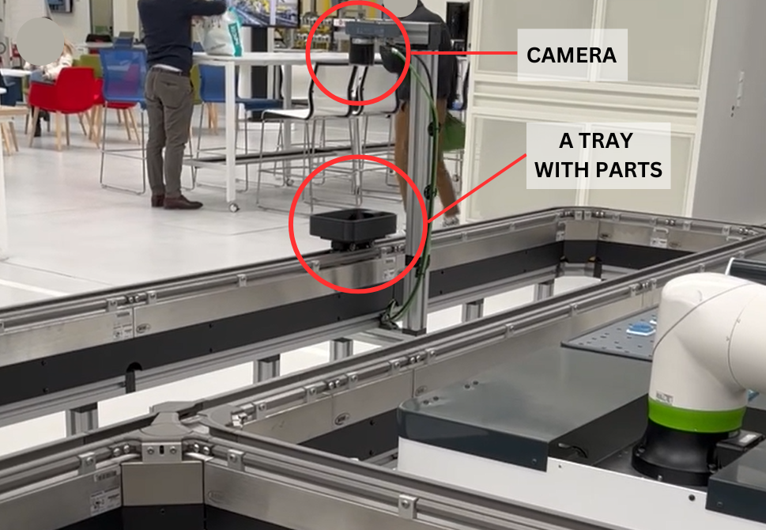
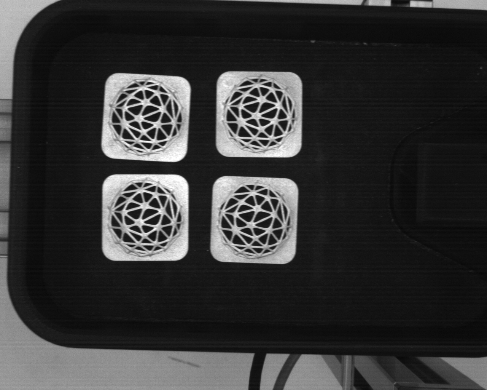
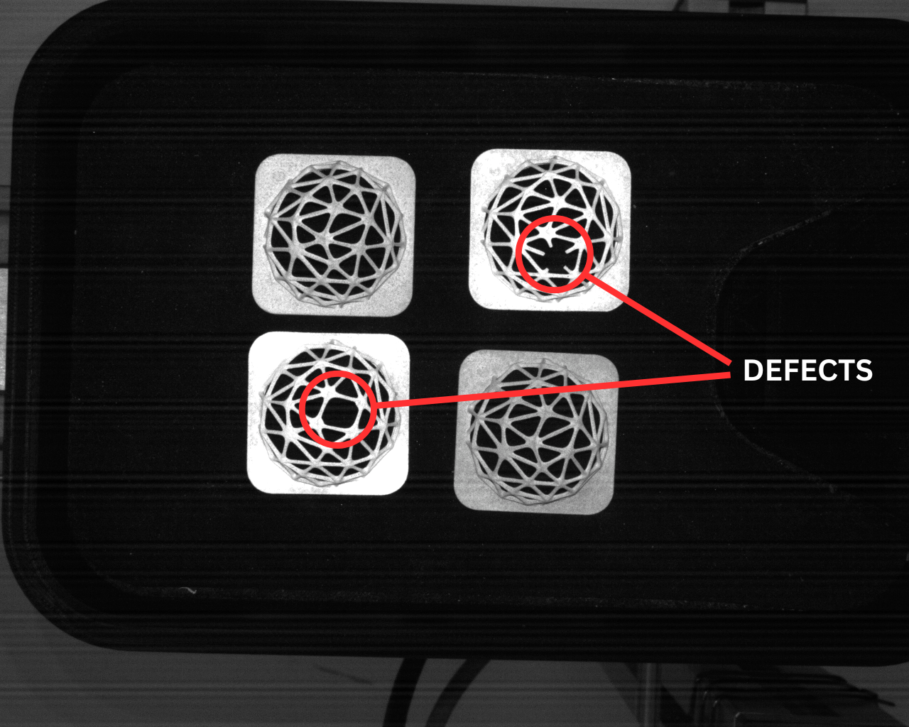

# Statistical Process Control for Quality Monitoring

## Project Overview

This project is part of the **Quality Data Analysis** course at Politecnico di Milano. The primary objective is to design and evaluate statistical methods for detecting defects in 3D-printed Voronoi filters. The study focuses on quality control through image analysis for a simulated production process.

## Data Acquisition

The dataset was collected using a mock **Flexible Manufacturing System (FMS)** setup at the MADE Competence Center I4.0 laboratory. The system consisted of trays carrying parts along a rail. When positioned under a camera, the system captured an image of the tray. The setup is depicted in the figure below:

Each tray contains four parts, positioned in the four corners. The images captured represent defect-free parts, as shown below:

In the second phase, images of parts with defects were introduced into the dataset. An example of such defects is highlighted below:

## Objectives

1. Implement **Statistical Process Control (SPC)** charts to monitor quality and identify anomalies in real-time.
2. Validate the performance of the SPC charts using a manually acquired list of actual faulty parts.

## Methodology

### Phase 1: Establishing Baseline Control
- Data from defect-free parts was used to develop SPC techniques.
- Key variables such as area, perimeter, and number of voids were analyzed.
- **Principal Component Analysis (PCA)** was applied to reduce noise and highlight patterns in the data.

### Phase 2: Fault Detection
- Control charts developed in Phase 1 were applied to a dataset with faulty parts.
- Faulty parts were identified based on control limits derived from the SPC charts.

## Statistical Analysis

The analysis utilized the following techniques:
- **Hotelling's T² control chart** for multivariate analysis.
- **Individual-Moving Range (I-MR)** charts for monitoring key variables and PCA scores.
- **Seasonal ARIMA modeling** to address observed periodicity in specific variables.

## Results and Conclusions

- Control charts successfully identified faulty parts in the Phase 2 dataset.
- PCA and Hotelling's T² control charts provided robust fault detection capabilities, outperforming traditional univariate methods.
- The methodology established a reliable framework for real-time quality monitoring in 3D printing applications.

## File Structure

The project consists of the following main files and folders:

- `CSV.ipynb`: The main analysis file written as a Jupyter Notebook.
- `image_analysis_function.py`: A Python function provided by the Department of Mechanical Engineering to transform images into CSV datasets containing numerical and characteristic information about part parameters.
- `qda.py`: A set of useful functions for Statistical Process Control (SPC), provided by the Department of Mechanical Engineering.
- `Figs/`: A folder containing figures used in the analysis report and README.
- `dataset_phase1/`: A folder containing data for Phase 1. It contains waw images collected during Phase 1 and a folder `Result` with the processed data from Phase 1. Inside this folder there is also a file `image_statistics.csv` - CSV file containing the the results of image analysis function for Phase 1 data.
- `dataset_phase2/`: A folder containing data for Phase 2. It contains waw images collected during Phase 2 and a folder `Result_phase2` with the processed data from Phase 2. Inside this folder there is also a file `image_statistics_phase2.csv` - CSV file containing the the results of image analysis function for Phase 2 data.
